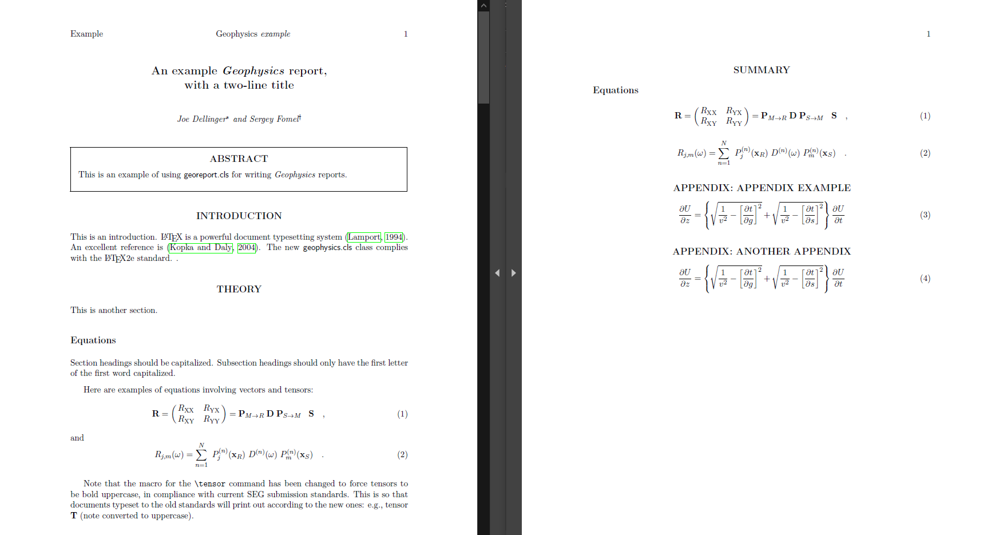
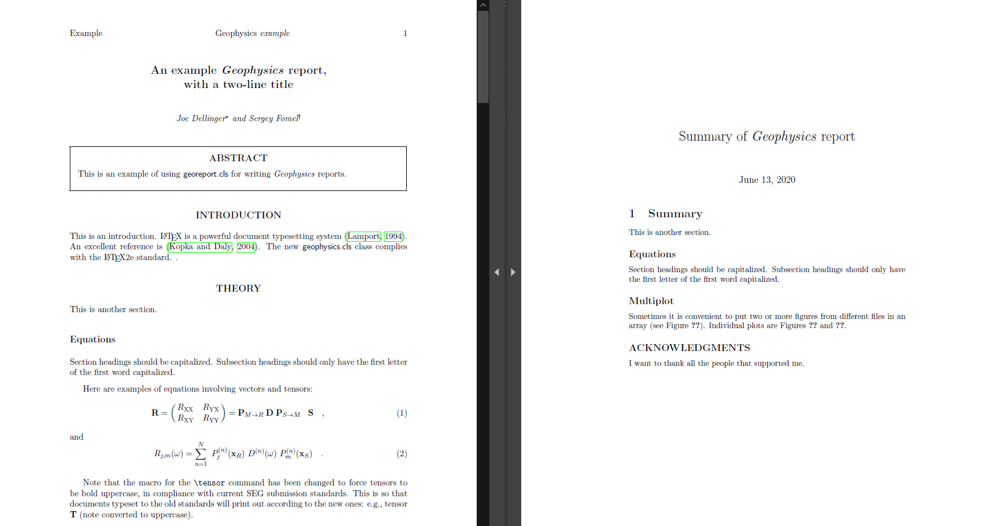

# LaTeX summarizer

A small Python script to generate a LaTeX file containing a class of snippets (e.g. equations, enumerate...) from a bigger LaTeX document.

## Usage

```
python3 summarize.py [-h] [-o OUT_FILE] TEX_MAIN ENV [ENV ...]
```

Generate a LaTeX file copying only specified envs from a source project.

```
positional arguments:
  TEX_MAIN     main .tex file containing document begin-end
  ENV          names of latex environments to copy in the generated .tex

optional arguments:
  -h, --help   show this help message and exit
  -o OUT_FILE  where to save the generated tex code (default './summary.tex')
```

## Requirements for the input TEX file

- The file should not contain syntax errors (like pending open environments)
- "\begin{...}" and "\end{...}" commands must appear on dedicated lines without anything else (comments are allowed)
- Chapter and section declarations must appear on dedicated lines as "\chapter{...}" or "\section{...}" (comments are allowed)

## Examples

### [Equations summary](examples/equations)



### [Text summary](examples/text)

